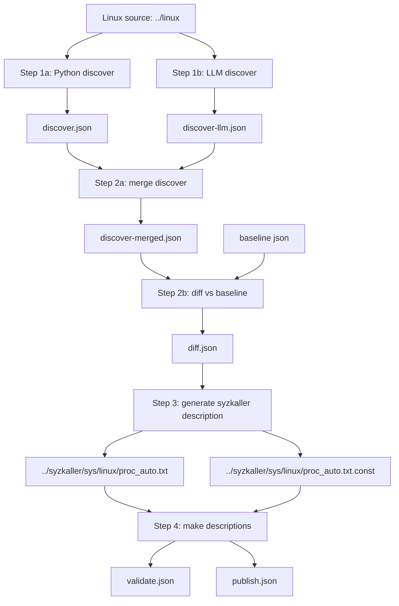

# hm-ai-fuzz

`hm-ai-fuzz` 是一个面向 Linux 接口发现、差集、syzkaller 描述生成与验证的插件化框架。

当前重点不是直接生成 program 级 `.syz`，而是先把“发现接口 -> 生成 syzkaller 描述 -> 编译验证”这条链路打通，并为后续接入更多模块和 LLM 留出统一框架。

## 总览

当前 `/proc` 已经落地一条完整主流程：

1. `discover`
2. `diff`
3. `generate`
4. `validate`

其中第 1 步又拆成三层 discover 结果：

- `discover.json`
  Python/规则发现结果
- `discover-llm.json`
  LLM discover 补充结果
- `discover-merged.json`
  第 2 步真正消费的 merged discover 结果

这意味着：

- Python 发现逻辑仍然是主干
- LLM 不再只是旁路建议
- 第 2 步已经会把 LLM discover 结果并入 merged 结果，再求差集

## 仓库布局

默认相对路径约定：

- 当前仓库：`.`
- Linux 源码：`../linux`
- syzkaller 源码：`../syzkaller`

也就是说，默认目录关系是：

```text
../
├── hm-ai-fuzz/
├── linux/
└── syzkaller/
```

## 流程图



文字版流程图：

```text
Linux source
  -> Python discover
  -> LLM discover
  -> merge discover
  -> diff vs baseline
  -> generate syzkaller description
  -> write into ../syzkaller/sys/linux/
  -> make descriptions
  -> validation / publish summary
```

## 当前目标

1. 用统一的数据模型承接不同子系统的接口发现结果。
2. 保留 4 步通用流程：`discover / diff / generate / validate`
3. 把 `/proc` 作为第一个插件化子系统。
4. 为后续扩展到 `/dev`、netlink、文件系统和其他 syscall family 留出稳定框架。

## 当前 `/proc` 实现

当前已经落地一条可运行的 `/proc` 主流程：

1. 第 1 步先从 Linux 源码里扫描 `fs/proc`，识别 `/proc` 节点及其 `open/read/write/lseek/getdents64/ioctl/mmap/poll` 等能力。
2. 如果启用 LLM discover，第 1 步还会输出独立的 `discover-llm.json`，用于补充发现结果。
3. 第 2 步先合并 `discover.json + discover-llm.json` 得到 `discover-merged.json`，再把 merged 结果拍平为接口项，并与已有基线做差集。
4. 第 3 步把新增接口生成到 `../syzkaller/sys/linux/proc_auto.txt` 和 `proc_auto.txt.const`。
5. 第 4 步在 `syzkaller` 目录执行 `make descriptions`，检查生成描述是否可编译。

当前 `/proc` 主流程同时支持两套输出：

- 现有运行格式：
  `discover.json / discover-llm.json / discover-merged.json / diff.json / generate.json / validate.json / publish.json`
- v2 统一协议格式：
  `discover-v2.json / discover-llm-v2.json / discover-merged-v2.json / diff-v2.json / generate-v2.json / validate-v2.json`

两套格式的定位：

- `v1`
  当前 `/proc` 主流程的兼容视图和回归基线
- `v2`
  后续统一协议，以及其他模块负责人新增用例时的推荐接入格式

## 目录

```text
core/                 # 通用 schema、pipeline、协议
extractors/proc/      # /proc 子系统发现插件
modelers/             # 统一模型转换层
generators/syzkaller/ # syzkaller 描述生成层
validators/           # 编译/诊断层
workflows/            # 顶层 workflow 入口
scripts/              # 验证脚本
```

## 阶段说明

### Step 1: Discover

输入：

- `--kernel-src`
- `--target-module`
- `--search-method`
- `--scan-mode`
- 可选 LLM 配置

输出：

- `discover.json`
  Python/规则发现结果
- `discover-llm.json`
  LLM discover 补充结果
- `discover-merged.json`
  暂不在第 1 步直接消费，而是在第 2 步前作为 merged 结果写出

说明：

- `discover.json` 负责提供可回归、可解释、保守的基础结果
- `discover-llm.json` 保留 LLM 补充发现的原始独立结果
- 当前 smoke 已验证：LLM discover 补充结果会真实影响后续 diff 数量

### Step 2: Diff

输入：

- `discover-merged.json`
- baseline JSON

输出：

- `diff.json`
- `diff-v2.json`

说明：

- 当前 `/proc` 差集键仍然是 `subsystem:target:op`
- `new_items` 是第 3 步真正消费的新增接口项
- 现在 `diff.json` 已经不是只对 base discover 做差集，而是对 merged discover 做差集

### Step 3: Generate

输入：

- `diff.json`
- `../syzkaller`

输出：

- `generate.json`
- `generate-v2.json`
- `../syzkaller/sys/linux/proc_auto.txt`
- `../syzkaller/sys/linux/proc_auto.txt.const`

说明：

- 这一层生成的是 syzkaller 描述层，不是 program 级 `.syz`
- 当前是最小模板生成器，优先保证“能写入、能编译、能被 syzkaller 消费”

### Step 4: Validate

输入：

- 第 3 步生成结果
- `../syzkaller`
- `make_target=descriptions`

输出：

- `validate.json`
- `validate-v2.json`
- `publish.json`

说明：

- `validate.json` 负责记录 `make descriptions` 的诊断
- `publish.json` 负责记录是否真的写入了外部 `syzkaller` 仓，并且编译是否通过

## 输入

- `--kernel-src`
  Linux 源码路径，默认相对当前仓库为 `../linux`
- `--syzkaller-dir`
  syzkaller 仓库路径，默认相对当前仓库为 `../syzkaller`
- `--target-module`
  当前默认为 `fs/proc`
- `--existing-json`
  可选基线 JSON；demo 阶段不传时等价于与空基线比较

## 输出

默认输出目录为 `out/`，其中：

- `out/discover.json`
  第 1 步 Python/规则发现结果
- `out/discover-llm.json`
  第 1 步 LLM discover 补充结果
- `out/discover-merged.json`
  第 2 步求差集前使用的 merged discover 结果
- `out/discover-v2.json`
  第 1 步 Python/规则发现结果的 v2 视图
- `out/discover-llm-v2.json`
  第 1 步 LLM discover 结果的 v2 视图
- `out/discover-merged-v2.json`
  merged discover 结果的 v2 视图
- `out/diff.json`
  第 2 步差集结果，基于 `discover-merged.json` 计算，`new_items` 是新增接口项
- `out/diff-v2.json`
  第 2 步 v2 协议结果
- `out/generate.json`
  第 3 步生成结果，记录生成文件和生成单元
- `out/generate-v2.json`
  第 3 步 v2 协议结果
- `out/validate.json`
  第 4 步编译验证结果
- `out/validate-v2.json`
  第 4 步 v2 协议结果
- `out/publish.json`
  外部 `syzkaller` 发布结果汇总
- `out/workflow-result.json`
  四步总汇总
- `out/llm/discover-suggestions.json`
  第 1 步 side-channel LLM 建议
- `out/llm/model-suggestions.json`
  第 2 步 side-channel LLM 建议
- `out/llm/fix-suggestions.json`
  第 4 步 side-channel LLM 建议

建议把 `out/` 分成两类理解：

- 主流程默认产物
  直接放在 `out/` 根目录，例如 `discover.json`、`workflow-result.json`
- 场景化验证产物
  放在 `out/scenarios/` 下，例如 fix-agent 故障注入、LLM 连通性验证

这里的 `demo` 不是“另一个正式流程”，而是“为了验证某个功能故意构造的场景”。
后续如果继续保留这些脚本，也统一落在 `out/scenarios/...`，不再在仓库根目录旁边散落多个 `out-*` 目录。

syzkaller 侧产物：

- `../syzkaller/sys/linux/proc_auto.txt`
- `../syzkaller/sys/linux/proc_auto.txt.const`

说明：

- `hm-ai-fuzz` 本身保存的是分析结果、生成元数据、验证结果和 LLM 建议
- 真正新增的 fuzz 描述文件会直接写入外部 `syzkaller` 仓库
- 当前 `/proc` 默认目标路径是 `../syzkaller/sys/linux/`

## 运行

```bash
cd ./hm-ai-fuzz
python3 -m workflows.proc_workflow --help
```

完整跑一遍：

```bash
cd ./hm-ai-fuzz
python3 -m workflows.proc_workflow \
  --workspace . \
  --kernel-src ../linux \
  --syzkaller-dir ../syzkaller \
  --out-dir ./out \
  --out-json ./out/workflow-result.json
```

或者直接跑验证脚本：

```bash
cd ./hm-ai-fuzz
bash scripts/validate_proc_workflow.sh
```

如果你要明确执行“发布到外部 syzkaller 仓并验证编译”，可以直接用：

```bash
cd ./hm-ai-fuzz
bash scripts/publish_proc_to_syzkaller.sh
```

如果你要跑启用 LLM 的 smoke 流程，可以在本地先设置环境变量，再限制样本数：

```bash
cd ./hm-ai-fuzz
source scripts/llm_env.local.sh
export HM_AI_FUZZ_LLM_DISCOVER_LIMIT=1
export HM_AI_FUZZ_LLM_MODEL_LIMIT=1
bash scripts/publish_proc_to_syzkaller.sh
```

如果环境里没有 `pytest`，可以直接跑内置无依赖测试：

```bash
cd ./hm-ai-fuzz
bash scripts/run_proc_test_suite.sh
```

## 当前状态

- `/proc` 发现逻辑基于真实 Linux 源码扫描，不是占位数据。
- 第 1 步已经拆成 `discover.base / discover.llm / discover.merged` 三层输出。
- 差集逻辑已经会基于 merged discover 按 `subsystem:target:op` 维度展开。
- syzkaller 生成逻辑已经会写入 `.txt` 和 `.txt.const`。
- 编译验证逻辑已经会执行 `make descriptions` 并提取诊断。
- `/proc` 的 v2 协议链路已经打通到 `generate_v2` 和 `validate_v2`。
- 当前已接入 3 个 side-channel LLM agent：
  - `discover_agent`
  - `model_agent`
  - `fix_agent`
- 这 3 个 agent 当前都不改写主流程产物，只额外输出建议 JSON，默认可关闭。
- 当前可参考 [schema/README.md](schema/README.md) 查看统一 schema 草案。
- 当前不删除 `v1`，原因是它仍承担兼容输出和回归对照作用；新模块接入优先按 `v2` 设计。

## LLM 开关

环境变量：

- `HM_AI_FUZZ_LLM_ENABLED=1`
  打开真实 LLM 调用
- `HM_AI_FUZZ_API_KEY`
  默认 API Key 环境变量
- `HM_AI_FUZZ_LLM_PROVIDER`
  当前默认 `openai_compatible`
- `HM_AI_FUZZ_LLM_MODEL`
  模型名
- `HM_AI_FUZZ_LLM_BASE_URL`
  OpenAI-compatible 接口地址
- `HM_AI_FUZZ_LLM_DISCOVER_ENHANCE=1`
  输出 `discover_agent` 建议
- `HM_AI_FUZZ_LLM_MODEL_ENHANCE=1`
  输出 `model_agent` 建议
- `HM_AI_FUZZ_LLM_FIX_SUGGEST=1`
  输出 `fix_agent` 建议
- `HM_AI_FUZZ_LLM_DEBUG_DIR=/abs/path`
  落盘原始 LLM 请求、原始返回、解析后 JSON，便于调 prompt 和 schema
- `HM_AI_FUZZ_LLM_DISCOVER_LIMIT=1`
  只抽样前 N 个 discover 项做 LLM 增强，便于快速 smoke test
- `HM_AI_FUZZ_LLM_MODEL_LIMIT=1`
  只抽样前 N 个 diff 项做 LLM 增强，便于快速 smoke test

如果只开 feature，不开 `HM_AI_FUZZ_LLM_ENABLED` 或不提供 API Key，系统会输出降级建议 JSON，并在 `warnings` 中注明当前未启用真实 LLM。

建议：

- 调试 prompt/schema 时，优先同时设置 `HM_AI_FUZZ_LLM_DEBUG_DIR`、`HM_AI_FUZZ_LLM_DISCOVER_LIMIT`、`HM_AI_FUZZ_LLM_MODEL_LIMIT`
- 先跑小样本 smoke test，再决定是否跑全量 LLM 增强
- 当前 smoke 验证已证明：第 1 步 LLM discover 结果会进入 `discover-merged`，并真实影响第 2 步 diff 数量

## 后续扩展方向

- 把 `/proc` 之外的子系统实现为新的 extractor/modeler/generator/validator 组合。
- 把第 3 步从最小描述生成扩展到更多 syscall 模式和参数模板。
- 把第 4 步从单次编译扩展到更细粒度的失败归因与自动修复回路。
