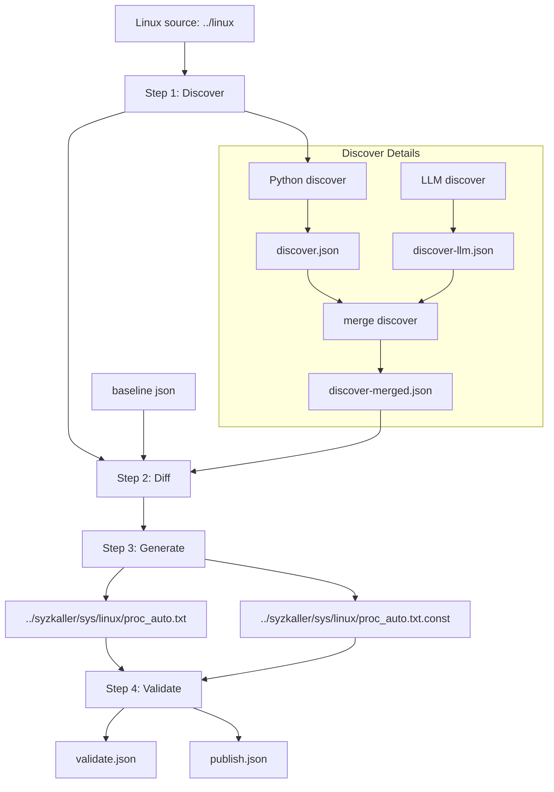

# hm-ai-fuzz

`hm-ai-fuzz` 是一个面向 Linux 接口发现、差集、syzkaller 描述生成与验证的插件化框架。

当前已经打通 `/proc` 的四步主流程，能够从 Linux 源码发现接口、生成 syzkaller 描述、写入外部 `syzkaller` 仓库并通过 `make descriptions` 验证；下一步重点是把这套框架扩展到更多模块，并继续增强 LLM 接入能力。

## 总览

当前 `/proc` 已经落地一条完整主流程：

1. `discover`
2. `diff`
3. `generate`
4. `validate`

其中第 1 步又拆成三层 discover 结果：

- `discover.json`
  Python/规则发现结果
- `discover-llm.json`
  LLM discover 补充结果
- `discover-merged.json`
  第 2 步真正消费的 merged discover 结果

这意味着：

- Python 发现逻辑仍然是主干
- LLM discover 已经参与真实差集
- 第 2 步已经会把 LLM discover 结果并入 merged 结果，再求差集

当前 discover 输入契约里：

- `target_subsystem` 是主语义目标
- `scope_path` 只是可选的路径缩小提示
- 即使不给路径，`/proc` 流程也可以基于语义模式做全量扫描

默认相对路径约定：

- 当前仓库：`.`
- Linux 源码：`../linux`
- syzkaller 源码：`../syzkaller`

也就是说，默认目录关系是：

```text
../
├── hm-ai-fuzz/
├── linux/
└── syzkaller/
```

## 流程图



当前 `/proc` 主流程同时保留两套输出视图：

- 现有运行格式：
  `discover.json / discover-llm.json / discover-merged.json / diff.json / generate.json / validate.json / publish.json`
- v2 统一协议格式：
  `discover-v2.json / discover-llm-v2.json / discover-merged-v2.json / diff-v2.json / generate-v2.json / validate-v2.json`

## 目录

```text
core/                 # 通用 schema、pipeline、协议
extractors/proc/      # /proc 子系统发现插件
modelers/             # 统一模型转换层
generators/syzkaller/ # syzkaller 描述生成层
validators/           # 编译/诊断层
workflows/            # 顶层 workflow 入口
scripts/              # 验证脚本
```

## 四步输入输出

### Step 1: Discover

输入：

- `--kernel-src`
- `--target-subsystem`
- `--scope-path`
- `--semantic-signal`
- `--search-method`
- `--scan-mode`
- 可选 LLM 配置

输出：

- `discover.json`
  Python/规则发现结果
- `discover-llm.json`
  LLM discover 补充结果
- `discover-merged.json`
  供第 2 步消费的 merged discover 结果

### Step 2: Diff

输入：

- `discover-merged.json`
- baseline JSON

输出：

- `diff.json`
- `diff-v2.json`

### Step 3: Generate

输入：

- `diff.json`
- `../syzkaller`

输出：

- `generate.json`
- `generate-v2.json`
- `../syzkaller/sys/linux/proc_auto.txt`
- `../syzkaller/sys/linux/proc_auto.txt.const`

### Step 4: Validate

输入：

- 第 3 步生成结果
- `../syzkaller`
- `make_target=descriptions`

输出：

- `validate.json`
- `validate-v2.json`
- `publish.json`

## 输出

默认输出目录为 `out/`，其中：

- `out/discover.json`
  第 1 步 Python/规则发现结果
- `out/discover-llm.json`
  第 1 步 LLM discover 补充结果
- `out/discover-merged.json`
  第 2 步求差集前使用的 merged discover 结果
- `out/discover-v2.json`
  第 1 步 Python/规则发现结果的 v2 视图
- `out/discover-llm-v2.json`
  第 1 步 LLM discover 结果的 v2 视图
- `out/discover-merged-v2.json`
  merged discover 结果的 v2 视图
- `out/diff.json`
  第 2 步差集结果
- `out/diff-v2.json`
  第 2 步 v2 协议结果
- `out/generate.json`
  第 3 步生成结果
- `out/generate-v2.json`
  第 3 步 v2 协议结果
- `out/validate.json`
  第 4 步编译验证结果
- `out/validate-v2.json`
  第 4 步 v2 协议结果
- `out/publish.json`
  外部 `syzkaller` 发布结果汇总
- `out/workflow-result.json`
  四步总汇总

syzkaller 侧产物：

- `../syzkaller/sys/linux/proc_auto.txt`
- `../syzkaller/sys/linux/proc_auto.txt.const`

## 运行

```bash
cd ./hm-ai-fuzz
python3 -m workflows.proc_workflow --help
```

完整跑一遍：

```bash
cd ./hm-ai-fuzz
python3 -m workflows.proc_workflow \
  --workspace . \
  --kernel-src ../linux \
  --syzkaller-dir ../syzkaller \
  --out-dir ./out \
  --out-json ./out/workflow-result.json
```

或者直接跑验证脚本：

```bash
cd ./hm-ai-fuzz
bash scripts/validate_proc_workflow.sh
```

如果你要明确执行“发布到外部 syzkaller 仓并验证编译”，可以直接用：

```bash
cd ./hm-ai-fuzz
bash scripts/publish_proc_to_syzkaller.sh
```

如果你要跑启用 LLM 的 smoke 流程，可以在本地先设置环境变量，再限制样本数：

```bash
cd ./hm-ai-fuzz
source scripts/llm_env.local.sh
export HM_AI_FUZZ_LLM_DISCOVER_LIMIT=1
export HM_AI_FUZZ_LLM_MODEL_LIMIT=1
bash scripts/publish_proc_to_syzkaller.sh
```

这条命令适合做小样本 LLM 联调验证，不是默认主流程入口。

如果环境里没有 `pytest`，可以直接跑内置无依赖测试：

```bash
cd ./hm-ai-fuzz
bash scripts/run_proc_test_suite.sh
```

## 更多说明

- 工作流说明：
  [workflow/README.md](workflow/README.md)
- 设计记录：
  [workflow/think.md](workflow/think.md)
- 统一 schema：
  [schema/README.md](schema/README.md)
- 当前保留 `v1` 和 `v2` 两套视图：
  `v1` 用于兼容输出和回归对照，`v2` 作为后续跨模块统一协议

## LLM 开关

环境变量：

- `HM_AI_FUZZ_LLM_ENABLED=1`
  打开真实 LLM 调用
- `HM_AI_FUZZ_API_KEY`
  默认 API Key 环境变量
- `HM_AI_FUZZ_LLM_PROVIDER`
  当前默认 `openai_compatible`
- `HM_AI_FUZZ_LLM_MODEL`
  模型名
- `HM_AI_FUZZ_LLM_BASE_URL`
  OpenAI-compatible 接口地址
- `HM_AI_FUZZ_LLM_DISCOVER_ENHANCE=1`
  输出 `discover_agent` 建议
- `HM_AI_FUZZ_LLM_MODEL_ENHANCE=1`
  输出 `model_agent` 建议
- `HM_AI_FUZZ_LLM_FIX_SUGGEST=1`
  输出 `fix_agent` 建议
- `HM_AI_FUZZ_LLM_DEBUG_DIR=/abs/path`
  落盘原始 LLM 请求、原始返回、解析后 JSON，便于调 prompt 和 schema
- `HM_AI_FUZZ_LLM_DISCOVER_LIMIT=1`
  只抽样前 N 个 discover 项做 LLM 增强，便于快速 smoke test
- `HM_AI_FUZZ_LLM_MODEL_LIMIT=1`
  只抽样前 N 个 diff 项做 LLM 增强，便于快速 smoke test

如果只开 feature，不开 `HM_AI_FUZZ_LLM_ENABLED` 或不提供 API Key，系统会输出降级建议 JSON，并在 `warnings` 中注明当前未启用真实 LLM。

建议：

- 调试 prompt/schema 时，优先同时设置 `HM_AI_FUZZ_LLM_DEBUG_DIR`、`HM_AI_FUZZ_LLM_DISCOVER_LIMIT`、`HM_AI_FUZZ_LLM_MODEL_LIMIT`
- 先跑小样本 smoke test，再决定是否跑全量 LLM 增强
- 当前 smoke 验证已证明：第 1 步 LLM discover 结果会进入 `discover-merged`，并真实影响第 2 步 diff 数量

## 后续扩展方向

- 把 `/proc` 之外的子系统实现为新的 extractor/modeler/generator/validator 组合。
- 把第 3 步从最小描述生成扩展到更多 syscall 模式和参数模板。
- 把第 4 步从单次编译扩展到更细粒度的失败归因与自动修复回路。
